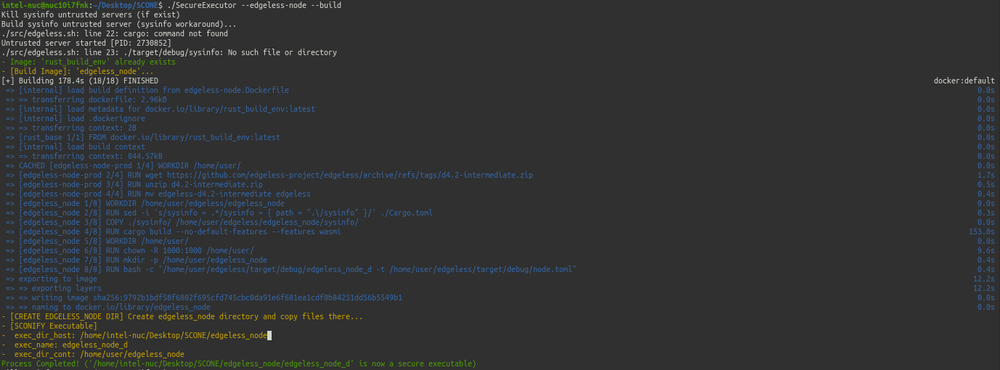
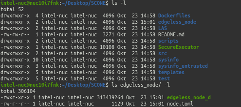
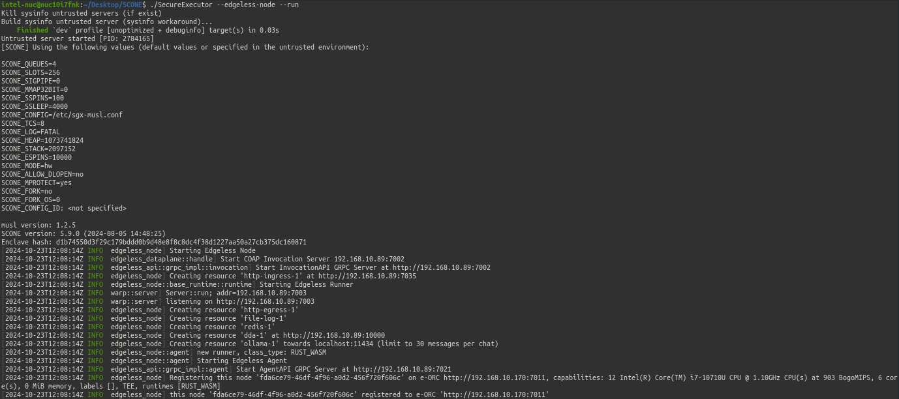
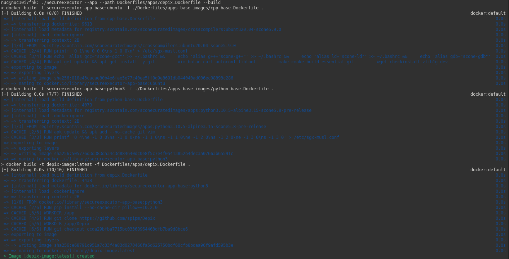
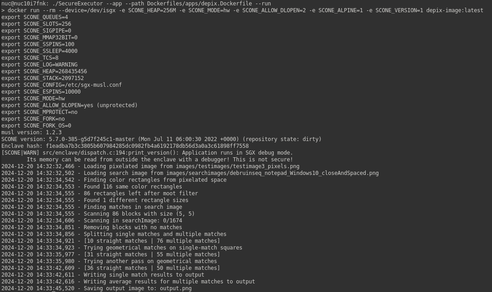
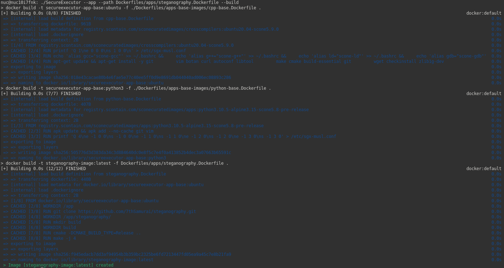
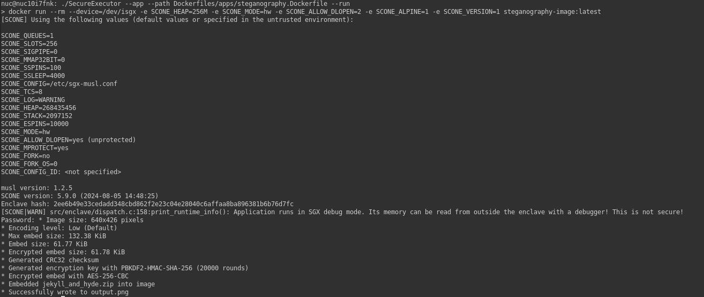

# Applications
To develop a tool that will automate this process for a broader range of existing applications in the future, $SecureExecutor$ is tested also on various open-source applications available on GitHub.

Applications:
1) [EDGELESS](./applications.md#edgeless)
2) [EDGELESS-FUNCTIONS](./applications.md#edgeless-functions)
3) [DEPIX](./applications.md#depix-python-project)
4) [STEGANOGRAPHY APPLICATION](./applications.md#steganography-c-project)

For now, users can automatically create and run only these specific predefined applications in different environments. Even though this could be considered a drawback, it is an essential intermediate step that aims to find clever ways to automate the process for a broader range of projects.

To build the trusted applications, $SecureExecutor$ utilizes some Docker images, which can be thought of as configuration files.
For these specific use cases, the created [Dockerfiles](../Dockerfiles/apps/) follow the documentation of each repository to build the confidential executables.
All of these images use trusted base images generated by $SecureExecutor$.
Hence, the application-specific [Dockerfiles](../Dockerfiles/apps/) can be written without considering SGX, focusing only on configuring the environment as required by each software's build process.

---

## EDGELESS
[EDGELESS](https://github.com/edgeless-project/edgeless) is a European-developed project that builds a framework that enables serverless edge computing. It is mainly intended for edge nodes with limited capabilities, and one of its goals is to secure these nodes by leveraging the specialized hardware they support, such as Intel SGX.

For more details regarding the EDGELESS specific implementation, read [this](./edgeless.md) file.

### Build EDGELESS
Although multiple steps are required to build the trusted image of the `edgeless_node`, a single $SecureExecutor$ command is used to achieve the desired operation.

### Configure
When this command is requested, a directory appears `edgeless_node/`. The trusted binary of `edgeless_node` and the `node.toml` configuration files are generated in this directory. `node.toml` needs to be modified based on the [EDGELESS instructions](https://github.com/edgeless-project/edgeless/blob/main/documentation/deploy_step_by_step.md) to connect with the EDGELESS system.

### Run EDGELESS
With a working `node.toml`, the execution of `./SecureExecutor –edgeless-node –run` is the final step to verify that the trusted node can establish a connection with the EDGELESS system.

---

## EDGELESS-FUNCTIONS
Experiments have also been conducted to integrate the SecureExecutor to build only the trusted images of EDGELESS functions (either utilizing the Rust or Python API), rather than the entire `edgeless_node` code. Refer to [this](./edgeless-function.md) file for more information.

---
---

## DEPIX (Python Project)
To make sure that $SecureExecutor$ can successfully build and run a generic Python project, we conducted some experiments with Depix project located on [GitHub](https://github.com/spipm/Depix). The code in this repository is used to recover plaintext from pixelized screenshots and has more than 25K stars and its License is this [one](https://github.com/spipm/Depix/blob/main/LICENSE).
Since it is not as complex as [EDGELESS](./applications.md#edgeless), we followed the single file configuration approach introduced at the beginning of the section. Regarding Depix, the only step we had to do was to develop the application-specific [Dockerfile](../Dockerfiles/apps/depix.Dockerfile).

### Build DEPIX

### Run DEPIX

---
---

## STEGANOGRAPHY (C++ Project)
The last implementation demonstrates the proposed $SecureExecutor$ behavior in a C++-based application available on [GitHub](https://github.com/7thSamurai/steganography). We created a trusted image for a security-oriented application. This project leverages custom implementations of SHA256, AES, and CRC32 to secure and embed a file in a picture using steganography principles.
This case also utilizes the single file configuration approach. Similarly to the Python implementation, the process was straightforward. We only had to develop the appropriate [Dockerfile](../Dockerfiles/apps/steganography.Dockerfile) following the repository documentation to build and run the executable.

### Build STEGANOGRAPHY

### Run STEGANOGRAPHY
