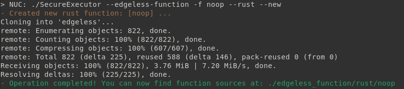
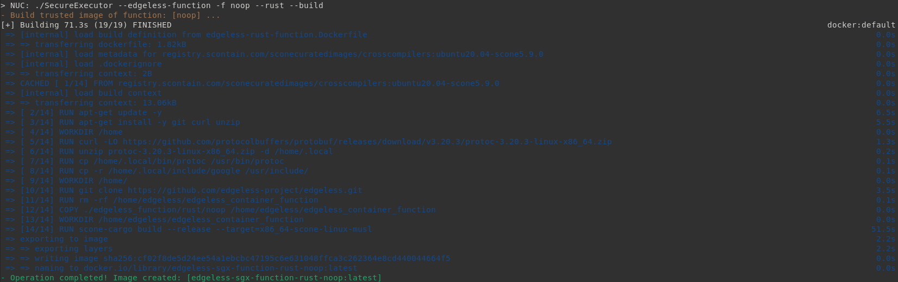
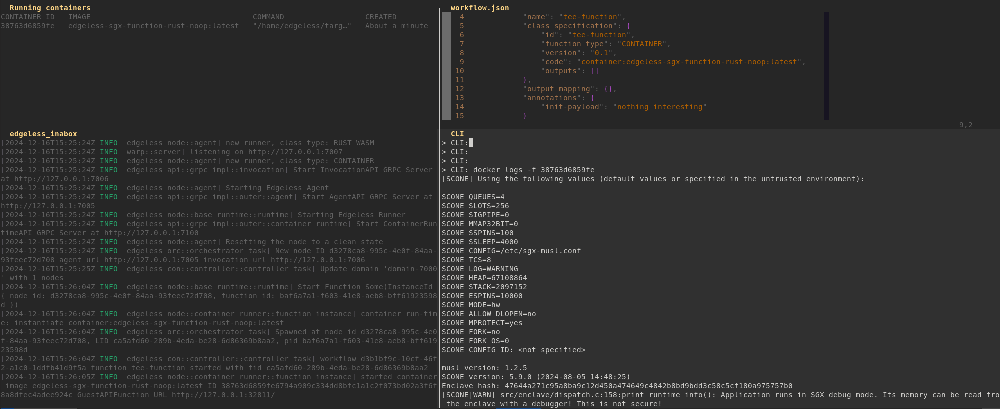

# EDGELESS Function
We can also use SecureExecutor to build trusted images for individual EDGELESS functions rather than the entire `edgeless_node`. The process is described in this file for a function that uses the [Rust API](https://github.com/edgeless-project/edgeless/tree/main/edgeless_container_function). Nonetheless, the same process can be applied to functions using the [Python API](https://github.com/edgeless-project/runtime-python).

## Create new edgeless function using Rust API

1. Create Rust function placeholder

2. Implement the desired function

After executing the above command, the function sources become available inside the `./edgeless_function/rust/noop` directory. A text editor can then be used to update the source code and develop the desired function.

3. Generate trusted function image.

4. Since we now have the trusted image ready, we can create a `workflow.json` file (as per the EDGELESS documentation) to utilize the function.

5. To run our function from an EDGELESS node and leverage SGX capabilities, ensure that an updated version of the EDGELESS platform code is available in the system (after commit #4a7dd6c)

6. Execution

In the following screenshot, four panes are displayed, showing the following information:
* **Running containers**: A list of currently running containers. (Only the container implementing the previously created function is running).
* **workflow.json**: The workflow configuration file, demonstrating the use of the generated function image in our workflow.
* **edgeless_inabox**: The `edgeless_inabox` is running on the same machine for demonstration purposes (this is NOT running in a TEE).
* **CLI**: The container logs, validating that the function code utilizes SCONE to run within a hardware enclave.

