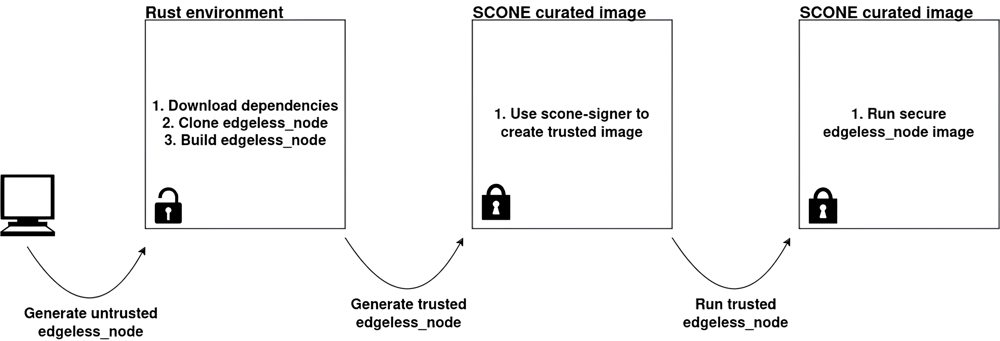
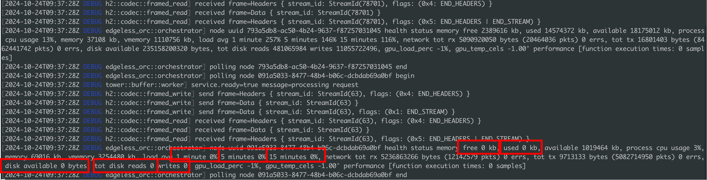
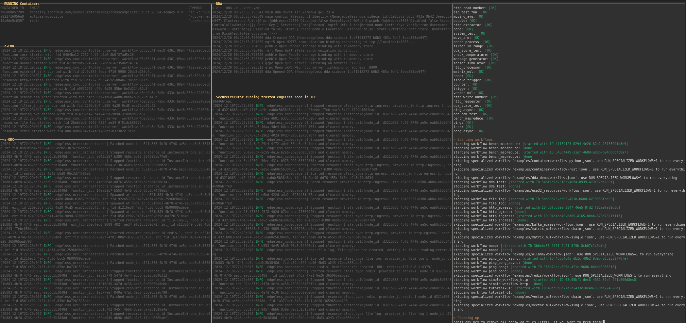

# EDGELESS

Due to the project’s complexity, the internal process for generating the `edgeless_node` image follows a 3-stage process.
This process is a bit different from the single file configuration introduced at the beginning of [applications.md](./applications.md), which we are trying to follow in the rest of use cases. Nevertheless, this characteristic of the study should be considered for the following versions of the tool.



In the first step, `edgeless_node` binary is created in a native Rust environment following this [Dockerfile](../Dockerfiles/apps/edgeless-node.Dockerfile).

---
---
## EDGELESS Runtime
$SecureExecutor$ utilizes [wasmi](https://github.com/edgeless-project/edgeless/tree/main/edgeless_node/src/wasmi_runner) as the runtime for the edgeless_node code. To understand the reason for this choice, please refer to this GitHub [issue](https://github.com/edgeless-project/edgeless/issues/159).

---
---

## Functions start-up latency
To calculate the start-up latency of a function, a timer is used in the `edgeless_node` code. Timer source code is available [here](../test/edgeless_tests/timer.rs).

For the initial tests, the start timer was initialised inside the `RuntimeTask::run()` function of [base_runtime/runtime.rs](https://github.com/edgeless-project/edgeless/blob/main/edgeless_node/src/base_runtime/runtime.rs), which is responsible for handling requests, as shown below:

```rust
pub async fn run(&mut self) {
  ...
  while let Some(req) = self.receiver.next().await {
     match req {
        RuntimeRequest::Start(spawn_request) => {   
              timer::start_timer(); // A new Start Request was received
              self.start_function(spawn_request).await;
           }
         ...
```
Then, the duration can be calculated as soon as the `edgefunction_handle_init()` function is executed from the [wasmi_runner/mod.rs](https://github.com/edgeless-project/edgeless/blob/main/edgeless_node/src/wasmi_runner/mod.rs) file. This function internally executes the `handle_init()` callback of the target function.

```rust
   let ret = tokio::task::block_in_place(|| {
      self.edgefunctione_handle_init
         .call(...)
   });
   log::info!(">>>>  Start-up latency: {}ms", timer::get_duration());

```
Below are some of the latencies observed during experiments.

Start-up latencies
| Experiment ID | SecureExecutor - edgeless_node in a TEE | Native execution |
| :------------ | :------: | ----: |
| 1             |   34ms   | 10ms  |
| 2             |    8ms   | 6ms   |
| 3             |  16ms    | 8ms   |
| 4             |  9ms     | 23ms  |

To do more tests when utilizing $SecureExecutor$.
1) Clone EDGELESS MVP in $SecureExecutor$ root directory.
    ```bash
    git clone https://github.com/edgeless-project/edgeless.git
    ```
2) Copy [timer](../test/edgeless_tests/timer.rs) source code inside the `edgeless_node/src` directory.
3) Enable its usage in the `edgeless_node/src/lib.rs` file.
4) Set `BUILD_MODE` to `DEVELOPMENT` in the `SecureExecutor` [sources](../src/edgeless.sh).
5) Build `edgeless-node` binary
    ```bash
    ./SecureExecutor --edgeless-node --build
    ```

---
---

## Known Issues
### 1) Sysinfo behaviour when executing from inside an enclave
During evaluation and verification, the following behavior was observed from the ε-ORC.



EDGELESS utilizes the sysinfo crate to retrieve system information during various operations, such as assessing `node capabilities` and `health status`.
This approach allows for the extraction of information related to available RAM, CPU usage, and more.
`Sysinfo` retrieves this data by reading files within the `/proc` filesystem.
However, due to shielding, SCONE is not able to read some procfs files, so `sysinfo` does not function as expected from within the trusted container.

#### Sysinfo workaround
As a workaround, sysinfo was split into [trusted](../sysinfo/) and [untrusted](../sysinfo_untrusted/) portions.

```tex
SecureExecutor
├── ...
├── sysinfo                 # sysinfo crate sources as git subtree (v. 0.32.0)
├── sysinfo_untrusted       # Untrusted part of sysinfo
├── ...
```

For the [trusted](../sysinfo/) part, the sysinfo crate has been added as a subtree within $SecureExecutor$ sources and has been modified to address the misbehavior observed in the EDGELESS node.

```bash
git subtree add --prefix=sysinfo https://github.com/GuillaumeGomez/sysinfo master --squash
```

This [trusted](../sysinfo/) part will handle all operations that function correctly.
For operations that misbehave, the [trusted](../sysinfo/) portion will communicate with the [untrusted](../sysinfo_untrusted/) part, which will request sysinfo to retrieve the metric and send it back to the [trusted](../sysinfo/) component.

The sysinfo version supported in the [trusted](../sysinfo/) part is `0.32.0`. Specifically, the commit with hash `c821de4249a85f566766890345830d4b24a2dcb7`, committed on October 10, 2024, was added as a Git subtree.

### Implementation
In the [Dockerfile](../Dockerfiles/apps/edgeless-node.Dockerfile) that builds the `edgeless_node` binary you will find the following part. This will copy from the tool's root directory `sysinfo` sources and will replace crate utilization with this one.
```Dockerfile
# Minor fix, related to sysinfo crate in edgeless_node when run from inside an enclave
# ====================================================================
RUN sed -i 's/sysinfo = .*/sysinfo = { path = ".\/sysinfo" }/' ./Cargo.toml
COPY ./sysinfo/ /home/user/edgeless/edgeless_node/sysinfo/
# ====================================================================
```

Inside the [trusted](../sysinfo/) part, the [requests](../sysinfo/src/requests/mod.rs) file has been added to communicate with the [untrusted](../sysinfo_untrusted/) part.

On the other hand, the [main.rs](../sysinfo_untrusted/src/main.rs) in the [untrusted](../sysinfo_untrusted/) part, will handle requests.

#### Sysinfo crate API calls affected
1. File: [sysinfo/src/common/disk.rs](../sysinfo/src/common/disk.rs) :: pub fn [refresh](../sysinfo/src/common/disk.rs)(&mut self)
   - disk available space

   ---

2. File: [sysinfo/src/common/system.rs](../sysinfo/src/common/system.rs) :: pub fn [refresh_specifics](../sysinfo/src/common/system.rs)(&mut self, refreshes: RefreshKind)
   - total disk reads
   - total disk writes

   ---

3. File: [sysinfo/src/common/disk.rs](../sysinfo/src/common/disk.rs) :: pub(crate) fn [refresh_list](../sysinfo/src/common/disk.rs)(&mut self)
   - disk available space

   ---

4. File: [sysinfo/src/unix/linux/system.rs](../sysinfo/src/unix/linux/system.rs) ::  pub(crate) fn [load_average](../sysinfo/src/unix/linux/system.rs)() -> LoadAvg
   * load avg

5. File: [sysinfo/src/unix/linux/system.rs](../sysinfo/src/unix/linux/system.rs) :: pub(crate) fn [refresh_memory_specifics](../sysinfo/src/unix/linux/system.rs)(&mut self, refresh_kind: MemoryRefreshKind)
   * total memory
   * free memory
   * available memory
   * used memory

> [!NOTE]
Not all parts of sysinfo code have been tested yet.


### Notes
1. In the [sysinfo_test](../sysinfo_untrusted/sysinfo_test/) sources the parts of sysinfo that edgeless_node code utilizes have been extracted for easier development of workaround.  
2. Run [run_sysinfo_test_in_tee_without_workaround.sh](../sysinfo_untrusted/run_sysinfo_test_in_tee_without_workaround.sh) in order to run [sysinfo_test](../sysinfo_untrusted/sysinfo_test/) directly on an enclave, without the need of edgeless_node agent, in order to verify sysinfo misbehaviour.
3. Run [run_sysinfo_test_in_tee_with_workaround.sh](../sysinfo_untrusted/run_sysinfo_test_in_tee_with_workaround.sh) (***Not working yet, need to fix openssl issue***) to evaluate workaround, without the need of edgeless_node agent.

---
---

### Dependencies
- [Rust](https://www.rust-lang.org/learn/get-started) (Only needed for EDGELESS, related to [sysinfo workaround](./doc/edgeless.md#sysinfo-workaround))
```bash
curl --proto '=https' --tlsv1.2 -sSf https://sh.rustup.rs | sh
```

### Examples started when edgeless_node executed in TEE
Edgeless is shipped with a script automatically running workflows, titled
[run_all_examples.sh](https://github.com/edgeless-project/edgeless/blob/main/scripts/run_all_examples.sh). During the experiments, this script was used to run all the non-specialized workflows.

#### Steps followed
1. Run `Redis` as required from `tutorial-01` example.
2. Follow the `dda_test` workflow scripts to set up your system (scripts that start `EDGELESS` components are not needed to be executed in this case).
3. Start `ε-CON` & `ε-ORC` on machine A.
4. Utilize `SecureExecutor` to start the trusted `edgeless_node` on a NUC device.
5. For the purposes of this test, the [run_all_examples.sh](https://github.com/edgeless-project/edgeless/blob/main/scripts/run_all_examples.sh) script was minimally modified. By default, it creates from scratch configuration files and starts the EDGELESS components, but in this case, these parts were commented out to only facilitate the examples part.

Bellow, a screenshot during the experiment is taken.



From this screenshot the following parts are visible:
* The docker containers currently running:
  * A trusted version of the `edgeless_node` is running in a container.
  * A `Redis` container, related to tutorial-01.
  * An `Eclipse Moscito` container, related to dda_test.

* Three panes are also available, one for each EDGELESS component.
  * `ε-ORC`
  * `ε-CON`
  * `SecureExecutor` who is running the `edgeless_node`.

* One pane for the `DDA`.
* A pane that is running the `run_all_examples.sh` script along its results.

The script executed the following examples:
* `bench_mapreduce/workflow-mapreduce-only`
* `bench_mapreduce/workflow-mapredece-process`
* `dda_test`
* `file_log`
* `http_egress`
* `http_ingress`
* `noop`
* `ping_pong_async`
* `ping_pong`
* `simple_workflow_http`
* `tutorial-01`

