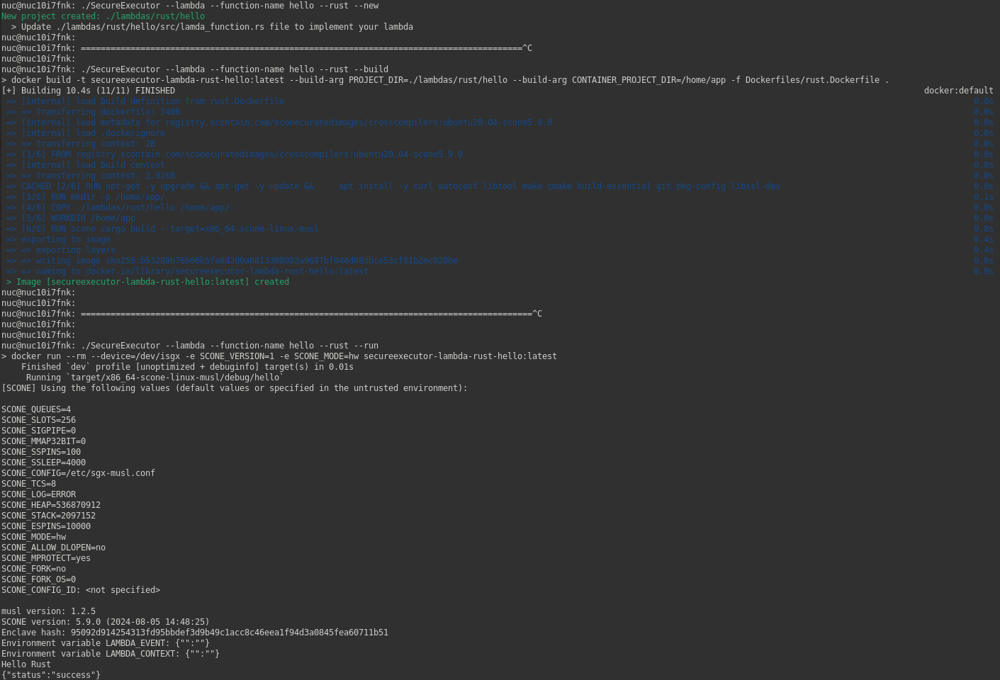

# Lambdas support

$SecureExecutor$ supports the creation, execution, and deletion of trusted images that contain minimal computational entities - called for the purposes of this tool as 'lambda' functions - in C++, Python, and Rust programming languages.

## Build and run a CPP Demo project

1. Create a template to store C++ code. In order to create a new lambda function named `hello`, we can run the following command.
```bash
./SecureExecutor    --lambda \
                    --cpp \
                    --function-name hello \
                    --new
```
*IMPORTANT*: All generated lambdas will be stored in a new directory titled `.lambdas/{programming-language}/{function-name}`.

The following project tree will be created in this case within the specified relative path `./lambdas/cpp/hello/`.

```bash
.
├── CMakeLists.txt
├── lambda_function.cpp
├── lambda_function.hpp
└── main.cpp
```

By default, when creating a new lambda, a "Hello World" project is generated. Therefore, if you would like to change the behavior of the lambda function, you should modify the `lambda_function.cpp` file.

In all supported programming languages, the respective `lambda_function` file contains a callback function that will be called from the main function. These callbacks follow a similar API. The handler takes two JSON arguments as input: one containing the event that triggered the function and the other holding the content to be used as input parameters for the computation part of the function.
Both can be passed as input parameters when running the trusted function.

```cpp
json lambda_handler(json& event, json& context) {
    // TODO: implement your lambda function
    std::cout << "Hello CPP" << std::endl;

    // Create response
    json response = { {"status", "success"} };
    return response;
}
```
You can also utilize external libraries (e.g., by using the FetchContent package) by modifying the appropriate `CMakeLists.txt` file (or `requirements.txt` and `Cargo.toml` for Python and Rust respectively).

2. Once you have implemented the required function, build the secure image.

```bash
./SecureExecutor    --lambda \
                    --cpp \
                    --function-name hello \
                    --build
```
This command will create a new Docker image in your system with the following name: `secureexecutor-lambda-${language}-${function-name}`.
```tex
> nuc@nuc: docker image ls            
REPOSITORY                              TAG     IMAGE ID      CREATED        SIZE
secureexecutor-lambda-cpp-static-hello  latest  a87519e0a5dc  4 minutes ago  2.72GB
```

3. As long as the docker image exists, we can also run the container.
```bash
./SecureExecutor    --lambda \
                    --cpp \
                    --function-name hello \
                    --run
```

If you want to pass a specific event or context to the lambda, you can use the `-e/--env` option. For example, if we have a function that $sums$ or $subtracts$ two numbers ($var_a$ and $var_b$), you could execute the following command:


```bash
./SecureExecutor    --lambda \
                    --cpp \
                    --function-name calc \
                    -e LAMBDA_EVENT=$(echo '{"type": "sum"}' | base64) \
                    -e LAMBDA_CONTEXT=$(echo '{"var_a": "10", "var_b": "20"}' | base64) \
                    --run
```
*IMPORTANT*: Both `LAMBDA_EVENT` and `LAMBDA_CONTEXT` are JSON objects and must be encoded in base64 before use.

4. When done, you can clean the generated image like this
```bash
./SecureExecutor    --lambda \
                    --cpp \
                    --function-name hello \
                    --clean
```

Note: You can also run all in a single command
```bash
./SecureExecutor --lambda --cpp --function-name hello --build --run --clean
```

## Build and run a Rust/Python Demo project
Along the same lines like C++, you can build, run and clean secure images from Rust/Python code, however, instead of using `--cpp` flag, use `--python`/`--rust`.

## Example in Rust (create, build & run)

